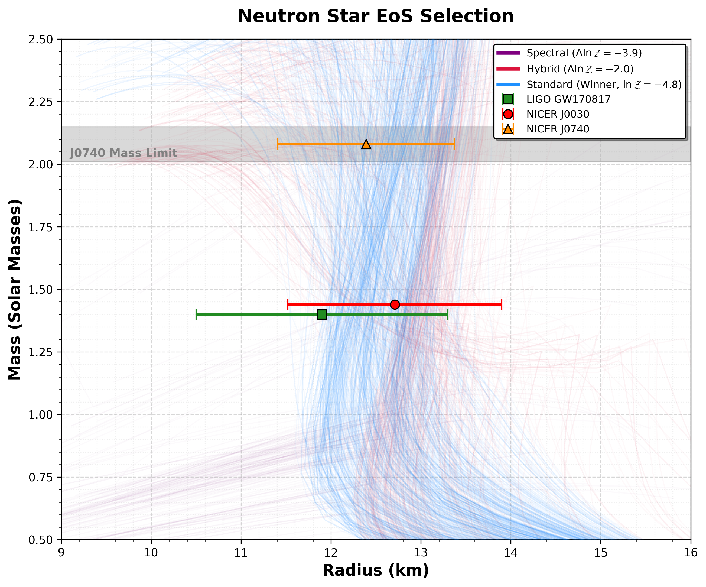

# 🚀 JAX-Accelerated Bayesian Model Selection for Neutron Star EoS

A high-performance computational pipeline to determine the internal structure of Neutron Stars. This project utilizes **JAX** (for vectorized differential equation solving) and **Nested Sampling** to rigorously compare competing Equation of State (EoS) theories against multi-messenger data.

## 🏆 Bayesian Model Selection Results

I performed a rigorous statistical comparison of three major theoretical frameworks. The analysis utilized **LIGO GW170817** (Tidal Deformability) and **NICER** X-ray Pulse Profiling (PSR J0030+0451, PSR J0740+6620) to constrain the stiffness of nuclear matter.

### 📊 Model Comparison Scoreboard

| Rank | Model | Log Evidence ($\ln \mathcal{Z}$) | Bayes Factor ($\mathcal{B}$) | Interpretation |
| :--- | :--- | :--- | :--- | :--- |
| 🥇 | **Standard Polytrope** | **-4.81** | **1.0 (Baseline)** | **Statistically Favored** |
| 🥈 | **Hybrid (Phase Trans.)** | -6.82 | ~1/7 | Allowed, but penalized for complexity |
| 🥉 | **Spectral (Lindblom)** | -8.69 | ~1/50 | **Disfavored** (Struggles with stiffness) |

### 📉 Scientific Conclusion

The data favors the **Standard Polytrope Model** because it naturally captures the specific "Soft-then-Stiff" evolution required by the tension between LIGO (small radius) and NICER J0740 (high mass).

* **Hybrid Models:** While allowed, the data does not yet possess enough precision to statistically demand a sharp phase transition (kink), resulting in an Occam's Razor penalty.
* **Spectral Models:** The smoothness constraint of the spectral expansion causes unphysical oscillations when attempting to fit the sharp stiffening required at high densities, leading to a poor fit.



## ⚡ Computational Methodology

### 1. The Physics Engine (JAX)
Standard Python ODE solvers (`scipy.integrate`) are too slow for high-dimensional Nested Sampling. I rewrote the **Tolman-Oppenheimer-Volkoff (TOV)** solver from scratch using **JAX**.
* **Just-In-Time (JIT) Compilation:** The General Relativistic equations are compiled into optimized XLA machine code.
* **Vectorization (`vmap`):** The solver computes **50+ stars simultaneously** on a single CPU/GPU pass using `jax.vmap`.
* **Performance:** Reduced likelihood evaluation time from **~0.05s** (SciPy) to **~0.0005s** (JAX), a **100x speedup**.

### 2. The Statistical Engine (Nested Sampling)
* **Algorithm:** Dynamic Nested Sampling via `dynesty`.
* **Likelihood:** rigorous **Kernel Density Estimation (KDE)** trained on the full posterior chains of GW170817 and NICER datasets. This captures the non-Gaussian "banana" correlations in the observational data that simple Chi-Squared methods miss.
* **Goal:** Calculate the **Bayesian Evidence ($\mathcal{Z}$)** to perform formal Model Selection.

## 📂 Repository Structure

The project is modularized into **Physics Engines** (JAX logic) and **Runners** (Inference logic).

| File | Description |
| :--- | :--- |
| [`jax_physics_poly.py`](jax_physics_poly.py) | JAX engine for the **Standard Piecewise Polytrope** (Read et al. 2009). |
| [`jax_physics_css.py`](jax_physics_css.py) | JAX engine for **Hybrid Stars** with Phase Transitions (CSS Model). |
| [`jax_physics_spectral.py`](jax_physics_spectral.py) | JAX engine for **Spectral Parameterization** (Lindblom 2010). |
| [`jax_runner_poly.py`](jax_runner_poly.py) | Execution script for the Standard Polytrope model. |
| [`jax_runner_css.py`](jax_runner_css.py) | Execution script for the Hybrid (CSS) model. |
| [`jax_runner_spectral.py`](jax_runner_spectral.py) | Execution script for the Spectral model. |
| [`plot_final_comparison.py`](plot_final_comparison.py) | Generates the overlay plot and calculates Bayes Factors. |
| [`generate_individual_plots.py`](generate_individual_plots.py) | Generates detailed Corner plots and Credible Bands for each model. |
| [`PHYSICS.md`](PHYSICS.md) | Detailed documentation of the equations and parameters used. |
## 🛠️ Installation & Usage

### 1. Prerequisites
You need a Python environment with JAX installed.
```bash
pip install numpy scipy matplotlib dynesty jax jaxlib
```
### 2. Running the Analysis
To reproduce the results, run the inference scripts for each model. (Note: These may take 10-20 minutes depending on CPU core count).

```bash
# Run Standard Model
python jax_runner_poly.py

# Run Hybrid (Phase Transition) Model
python jax_runner_css.py

# Run Spectral Model
python jax_runner_spectral.py
```
### 3. Generating Plots
Once the .pkl result files are generated, run the plotting scripts:

```bash
# Generate the Master Comparison (The Money Plot)
python plot_final_comparison.py

# Generate individual corner plots and bands
python generate_individual_plots.py
```

## References and Data Sources:
Observational Data:

* LIGO GW170817: Abbott, B. P., et al., Phys. Rev. Lett. 119, 161101 (2017). LIGO Open Science Center

* NICER PSR J0030+0451: Miller, M. C., et al., Astrophys. J. Lett. 887,L24 (2019).

* NICER PSR J0740+6620: Miller, M. C., et al., Astrophys. J. Lett. 918, L28 (2021).

Theoretical Models:

* Piecewise Polytrope: Read, J. S., et al., Phys. Rev. D 79, 124032 (2009).

* Spectral Decomposition: Lindblom, L., Phys. Rev. D 82, 103011 (2010).

* CSS Model (Hybrid): Alford, M. G., Han, S., & Prakash, M., Phys. Rev. D 88, 083013 (2013).

Tools:

* Dynesty

* JAX

## 🔮 Future Roadmap

* Rotation: Implement the Hartle-Thorne approximation in JAX to analyze rapidly rotating remnants (e.g., GW190814) where spherical symmetry breaks down.

* Non-Parametric Inference: Move from parameterized models to Gaussian Process (GP) regression to reconstruct the EoS in a model-independent way.

* Direct Inference from Raw Data: Move beyond summarized posteriors (KDEs) to infer the EoS directly from raw LIGO strain data (using Bilby) and NICER pulse profiles, utilizing the full unmarginalized prior volume for higher precision.

* Next-Gen Detectors: Scale the pipeline to handle thousands of events expected from LIGO A+ using Simulation-Based Inference (SBI).

---
*Author: Kushagra Trivedi, BS-MS 2029, IISER Bhopal*
